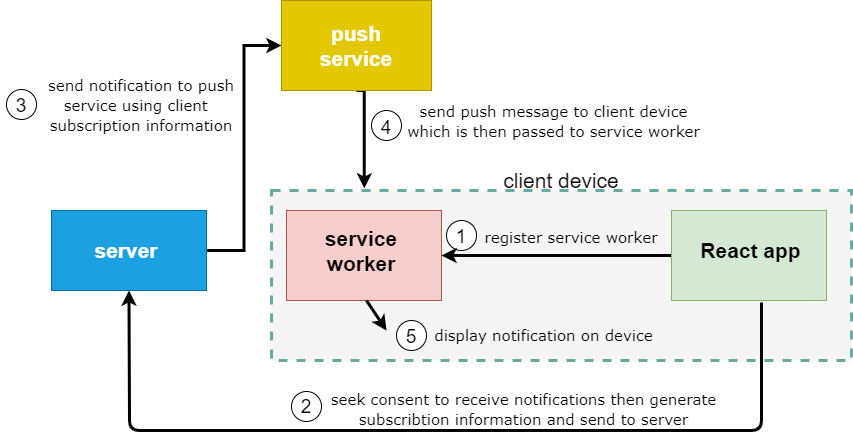

# WebPushnator: Example using Web Push Notifications

This project is just an example of use of web push notifications.

I have started with this excellent tutorial: https://www.telerik.com/blogs/implementing-web-push-notifications-mern-stack-application

With WebPushnator you can:
* subscribe giving a name to client subscription and send notification to all client subscriptions.
* unsubscribe and send the notification to all other client subscriptions.
* send a notification to any client subscription.


## Prerequisites

You need a working environment with:
* [Git](https://git-scm.com) - You can install it from https://git-scm.com/downloads.

## Getting started

To test this project clone the project:

```
git clone https://github.com/tcrurav/WebPushnator.git
```

Install all dependencies:

```
cd WebPushnator/frontend
npm install

cd WebPushnator/backend
npm install
```

Run the following command in your backend to get a pair of public and private keys:

```
npm run gen_vapid_keys
```

Create a .env in your backend folder with your own data:

```
DB_HOST=<your-database-host>
DB_USER=<your-database-user>
DB_PASSWORD=<your-database-password>
DB_NAME=<your-database-name>

PUBLIC_KEY=<your-vapid-public-key>
PRIVATE_KEY=<your-vapid-private-key>
```

Create a .env in your frontend folder with your own data:

```
VITE_API_URL=http://localhost:8080/api/subscriptions
VITE_PUBLIC_KEY=<your-vapid-public-key>
VITE_PUBLIC_URL=
```

Finally run both your backend and frontend:

```
cd WebPushnator/frontend
npm start

cd WebPushnator/backend
npm run dev
```

To test this project the best is to open 3 diferent browsers and start sending notifications.

Enjoy!!!


## Image from (https://www.telerik.com/blogs/implementing-web-push-notifications-mern-stack-application)

This image gives a good idea about how web push notification work:



## Built With

* [Visual Studio Code](https://code.visualstudio.com/) - The Editor used in this project.


## Acknowledgments

* https://gist.github.com/PurpleBooth/109311bb0361f32d87a2. A very complete template for README.md files.
* https://www.conventionalcommits.org/en/v1.0.0/. A specification for adding human and machine readable meaning to commit messages.
* https://nvie.com/posts/a-successful-git-branching-model/. A successful Git branching model.
* https://learngitbranching.js.org/?locale=es_ES. A really funny game to learn Git branching.
* https://www.telerik.com/blogs/implementing-web-push-notifications-mern-stack-application. Excellent tutorial to learn about web push notifications.

